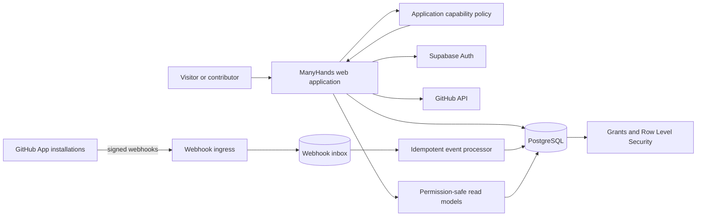

# Architecture

**Status:** Accepted starting direction with the repository, application, database, and authorization foundations implemented through issues #1, #3, and #4. Later modules continue through roadmap issues and ADRs.

## Architectural goals

- Keep the official instance easy to operate and the community version practical to self-host.
- Make product permissions explicit and testable.
- Treat GitHub as an external system of record for code activity, not as the ManyHands database.
- Preserve an auditable event trail without coupling every page load to GitHub APIs.
- Prefer standards and replaceable components over clever infrastructure.
- Support gradual growth without designing a distributed system on day one.
- Keep authentication identity, stable attribution, project roles, and global account status separate.
- Make public read models intentionally smaller than internal write models.

## Initial stack

- **Language:** TypeScript with strict type checking.
- **Workspace:** pnpm workspaces; no task orchestrator until demonstrated necessary.
- **Web application:** Next.js App Router with server-first rendering and progressive enhancement.
- **Database:** PostgreSQL hosted initially on Supabase, reproduced locally through the pinned Supabase CLI.
- **Authentication:** Supabase Auth with GitHub as the first identity provider.
- **Authorization:** typed application capability policies plus PostgreSQL grants and Row Level Security where they strengthen—not replace—server-side checks.
- **GitHub integration:** a dedicated GitHub App for repository installation and signed webhooks. User sign-in and repository integration remain separate permission surfaces.
- **Search:** PostgreSQL full-text search and trigram indexes before adding a separate search service.
- **Validation:** shared runtime schemas at trust boundaries.
- **Testing:** unit and service tests, transactional database/RLS tests, and Playwright end-to-end tests for critical flows.
- **Deployment:** official web deployment on Vercel and managed PostgreSQL on Supabase, with documented self-hosting paths.

The implemented foundation pins Node.js, pnpm, application dependencies, and the Supabase CLI in source control. Future libraries are pinned when a reviewed implementation demonstrates the need.

## Current repository shape

```text
apps/
  web/                    # Next.js application and HTTP boundary
packages/
  domain/                 # typed capability policies, invariants, domain errors
  data/                   # generated schema types and typed data boundaries
supabase/
  config.toml             # CLI-generated local project contract
  migrations/             # immutable database migrations
  seed.sql                # synthetic, non-personal, secret-free seed
  tests/database/         # pgTAP schema, grant, RLS, and lifecycle tests
tests/
  unit/                   # application and policy tests
  e2e/                    # production-server browser tests
docs/
  decisions/              # Architecture Decision Records
```

Future `github`, `ui`, or shared configuration packages are created only when a real boundary and consumer exist. Empty architecture placeholders are deliberately avoided.

## Context diagram



## Product modules

### Identity

Supabase Auth owns external authentication identity and sessions. `private.accounts` owns stable ManyHands attribution and global lifecycle state. `public.contributor_profiles` owns user-chosen profile fields and visibility.

OAuth identity proves who controls a session; it does not decide what that person can do. Provider email and metadata are not automatically public.

Deleting an authentication identity detaches it from the stable account and scrubs optional profile data while preserving neutral attribution where justified history still references the account.

See [`decisions/0003-stable-identity-and-public-read-models.md`](decisions/0003-stable-identity-and-public-read-models.md).

### Problems

Owns problem statements, need signals, follows, moderation state, and revision history.

### Projects

Owns project formation, membership, stewardship, scope, health, and handoffs.

### Contributions

Owns contribution needs, contributor interest, claims, onboarding handoffs, and acknowledgement history.

### Roadmaps

Owns milestones, blockers, evidence, and derived progress.

### GitHub bridge

Owns GitHub App installations, repository links, webhook verification, event normalization, synchronization, API rate limits, and revocation.

### Discovery

Builds searchable, permission-safe read models for problems, projects, needs, skills, platforms, and health.

### Trust and safety

Owns reports, moderation actions, rate limiting, audit records, content policy, and appeals. Project-scoped moderation never silently implies global moderation.

## Dependency direction

The initial dependency direction is:

```text
apps/web --> packages/domain
apps/web --> packages/data
packages/data -/-> packages/domain unless a repository API needs domain types
packages/domain -/-> packages/data
packages/domain -/-> Next.js, Supabase clients, or GitHub clients
```

`packages/domain` stays framework- and database-independent so capability decisions can be tested without a server or PostgreSQL process.

`packages/data` exposes generated schema types and later small repository implementations. Generated types are byte-compared against a clean migrated database in CI and are never hand-edited.

## GitHub integration rules

1. Use a GitHub App for repositories; do not ask a user OAuth token to become a permanent integration token.
2. Request the minimum repository permissions needed for each shipped feature.
3. Verify every webhook signature before parsing trusted fields.
4. Store delivery identifiers and process idempotently.
5. Acknowledge webhooks quickly; perform projection work asynchronously.
6. Keep an append-only inbox record with retention limits and redaction for sensitive payload fields.
7. Cache normalized metadata in ManyHands; link to GitHub for authoritative code detail.
8. Handle renamed, transferred, archived, deleted, and access-revoked repositories explicitly.
9. Respect GitHub rate limits and surface sync freshness rather than hiding failure.
10. Never infer ManyHands authorization solely from GitHub repository permissions.

## Data and consistency

PostgreSQL is the system of record for ManyHands concepts. Writes occur through server boundaries that validate untrusted input, enforce application capability policy, and rely on explicit database grants and RLS as defense in depth.

The current database separates:

- `auth` for provider identity and sessions;
- `private` for internal account identity, lifecycle state, and narrow helpers;
- `public` for product data that may require Data API access;
- explicit public views for signed-out discovery.

GitHub events are eventually consistent. The interface displays `last_synced_at`, source links, and degraded states. A transactional outbox is preferred for internal asynchronous work so database changes and emitted events cannot silently diverge.

Migrations are immutable after merge. Corrective migrations are new files. Seed data contains no production secrets or personal data. Database CI rebuilds from zero, runs pgTAP, lints PostgreSQL code, and verifies generated-type drift.

See [`DATABASE.md`](DATABASE.md).

## Authorization model

Authorization answers a capability question, for example:

```text
can(principal, "profile.update", profile)
can(principal, "project.update", project)
can(principal, "contribution_need.claim", need)
can(principal, "moderation.report.read_private", report)
```

The implemented policy contract lives in `packages/domain/src/authorization.ts` and returns an explicit allowed or denied decision with a bounded reason.

Current rules prove that:

- public profile reads may be anonymous;
- private profile reads are owner-only;
- profile updates require an active owner;
- suspended accounts cannot perform protected writes;
- project updates require an exact project steward or maintainer role;
- project moderation does not become global moderation;
- private report access requires an active global moderator.

Do not scatter checks such as `isAdmin`, `isOwner`, or `isSubscribed` across UI components. Policies are centralized, unit-tested, and rechecked at the server boundary. The UI may hide unavailable actions for clarity but never becomes the security boundary.

Every exposed database table also needs explicit grants, RLS, and positive plus negative database tests. Neither application policy nor RLS is sufficient alone.

## Public and private data

Public read models are designed separately from internal write models. They exclude OAuth tokens, installation tokens, private emails, moderation notes, abuse signals, IP data, and security telemetry.

`public.profile_directory` is a `security_invoker` view containing only fields approved for signed-out profile discovery. New internal columns do not automatically enter that view.

The initial retention, suspension, deletion, anonymization, export, logging, and future-field review contract is documented in [`DATA_LIFECYCLE.md`](DATA_LIFECYCLE.md).

## Function and RLS security

Privileged database functions are exceptional and require review. They must:

- live outside exposed schemas;
- use an empty or explicitly safe `search_path`;
- accept no caller-selected identity when `auth.uid()` can establish it;
- revoke default `PUBLIC` execution;
- grant execution only to required roles;
- return the smallest necessary result;
- receive matching negative tests and database linting.

An update policy must consider both row selection and `USING`/`WITH CHECK` behavior. A column-level grant must not permit ownership reassignment.

## Threat model baseline

Priority threats include:

- forged or replayed GitHub webhooks;
- stolen OAuth, session, service-role, or installation tokens;
- cross-user and cross-project privilege escalation;
- public exposure of private email, reports, lifecycle state, or moderator notes;
- malicious Markdown, links, or uploaded assets;
- spam, brigading, fake demand signals, and impersonation;
- SSRF through repository or evidence URLs;
- unsafe dependency or workflow contributions;
- destructive steward actions against project history;
- incomplete account deletion or accidental restoration of anonymized data;
- synchronization loops and API-rate exhaustion.

Each implementation issue touching a trust boundary adds negative tests. Protected database access is denial-by-default.

## Accessibility and performance

Server-render the public directory and core detail pages. JavaScript enhances rather than gates reading. Core actions must remain keyboard accessible, announce state changes, respect reduced motion, and work at narrow widths.

Define performance budgets when the first product directory is implemented. Avoid loading GitHub activity directly from third-party APIs in the browser.

## Observability

Use structured logs with request and event correlation IDs, but never tokens, private profile text, or sensitive report content. Track webhook failures, sync age, authorization denials, moderation queues, database errors, lifecycle failures, and critical user-flow outcomes. Operational telemetry is not a public reputation system.

## Delivery strategy

Build vertical slices in roadmap order.

The completed foundations provide:

1. a contributor-ready repository and public roadmap;
2. a production-shaped, accessible Next.js shell;
3. a reproducible PostgreSQL/Supabase identity boundary;
4. centralized application authorization;
5. isolated application and database quality gates.

The next vertical slice is issue #5: GitHub sign-in, account lifecycle, session security, and a minimal profile experience using these established boundaries. Problems, Projects, contribution needs, milestones, and GitHub repository synchronization follow in their roadmap issues.

No microservices are planned for v0. Extract a service only when a measured reliability, scaling, security, or ownership boundary justifies it.
