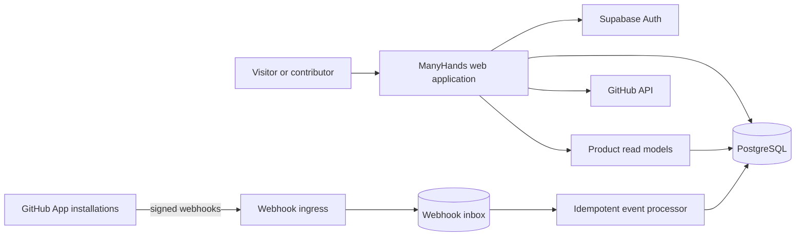

# Architecture

**Status:** Accepted starting direction; implementation begins through roadmap issues and ADRs.

## Architectural goals

- Keep the official instance easy to operate and the community version practical to self-host.
- Make product permissions explicit and testable.
- Treat GitHub as an external system of record for code activity, not as the ManyHands database.
- Preserve an auditable event trail without coupling every page load to GitHub APIs.
- Prefer standards and replaceable components over clever infrastructure.
- Support gradual growth without designing a distributed system on day one.

## Initial stack

- **Language:** TypeScript with strict type checking.
- **Workspace:** pnpm workspaces; no task orchestrator until demonstrated necessary.
- **Web application:** Next.js App Router with server-first rendering and progressive enhancement.
- **Database:** PostgreSQL hosted initially on Supabase.
- **Authentication:** Supabase Auth with GitHub as the first identity provider.
- **Authorization:** application service policies plus PostgreSQL Row Level Security where it strengthens—not replaces—server-side checks.
- **GitHub integration:** a dedicated GitHub App for repository installation and signed webhooks. User sign-in and repository integration remain separate permission surfaces.
- **Search:** PostgreSQL full-text search and trigram indexes before adding a separate search service.
- **Validation:** shared runtime schemas at trust boundaries.
- **Testing:** unit and service tests, database integration tests, and Playwright end-to-end tests for critical flows.
- **Deployment:** official web deployment on Vercel and managed PostgreSQL on Supabase, with documented self-hosting paths.

Library versions are pinned only when the implementation issue begins, so this document does not become a stale package manifest.

## Proposed repository shape

```text
apps/
  web/                    # Next.js application and HTTP boundary
packages/
  domain/                 # entities, state machines, policies, domain errors
  data/                   # typed database access and repositories
  github/                 # GitHub App, webhook normalization, sync adapters
  ui/                     # accessible shared interface components
  config/                 # lint, TypeScript, test, and shared tooling
supabase/
  migrations/             # immutable database migrations
  seed/                   # safe local development data
docs/
  decisions/              # Architecture Decision Records
```

The bootstrap issue may simplify this shape if it preserves the boundaries.

## Context diagram



## Product modules

### Identity

Maps GitHub identities to internal users, manages account state, profile visibility, and session security. OAuth identity proves who a person is; it does not decide what they can do.

### Problems

Owns problem statements, need signals, follows, moderation state, and revision history.

### Projects

Owns project formation, membership, stewardship, scope, health, and handoffs.

### Contributions

Owns contribution needs, contributor interest, claims, onboarding handoffs, and acknowledgement history.

### Roadmaps

Owns milestones, blockers, evidence, and derived progress.

### GitHub bridge

Owns GitHub App installations, repository links, webhook verification, event normalization, synchronization, API rate limits, and revocation.

### Discovery

Builds searchable, permission-safe read models for problems, projects, needs, skills, platforms, and health.

### Trust and safety

Owns reports, moderation actions, rate limiting, audit records, content policy, and appeals.

## GitHub integration rules

1. Use a GitHub App for repositories; do not ask a user OAuth token to become a permanent integration token.
2. Request the minimum repository permissions needed for each shipped feature.
3. Verify every webhook signature before parsing trusted fields.
4. Store delivery identifiers and process idempotently.
5. Acknowledge webhooks quickly; perform projection work asynchronously.
6. Keep an append-only inbox record with retention limits and redaction for sensitive payload fields.
7. Cache normalized metadata in ManyHands; link to GitHub for authoritative code detail.
8. Handle renamed, transferred, archived, deleted, and access-revoked repositories explicitly.
9. Respect GitHub rate limits and surface sync freshness rather than hiding failure.
10. Never infer ManyHands authorization solely from GitHub repository permissions.

## Data and consistency

PostgreSQL is the system of record for ManyHands concepts. Writes occur through domain services that enforce state transitions and authorization.

GitHub events are eventually consistent. The interface displays `last_synced_at`, source links, and degraded states. A transactional outbox is preferred for internal asynchronous work so database changes and emitted events cannot silently diverge.

Migrations are immutable after merge. Corrective migrations are new files. Seed data must contain no production secrets or personal data.

## Authorization model

Authorization answers a capability question, for example:

```text
can(user, "project.update", project)
can(user, "contribution_need.claim", need)
can(user, "moderation.report.read_private", report)
```

Do not scatter checks such as `isAdmin` or `isOwner` across UI components. Policies are centralized, unit-tested, and rechecked at the server boundary. The UI may hide unavailable actions for clarity but never becomes the security boundary.

## Public and private data

Public read models are designed separately from internal write models. They must exclude OAuth tokens, installation tokens, private emails, moderation notes, abuse signals, IP data, and security telemetry.

Data export and deletion semantics will be designed before collecting optional profile data beyond the v0 requirement.

## Threat model baseline

Priority threats include:

- forged or replayed GitHub webhooks;
- stolen OAuth or installation tokens;
- cross-project privilege escalation;
- malicious Markdown, links, or uploaded assets;
- spam, brigading, fake demand signals, and impersonation;
- SSRF through repository or evidence URLs;
- unsafe dependency or workflow contributions;
- accidental public exposure of reports or private emails;
- destructive steward actions against project history;
- synchronization loops and API-rate exhaustion.

Each implementation issue touching a trust boundary must add negative tests.

## Accessibility and performance

Server-render the public directory and core detail pages. JavaScript enhances rather than gates reading. Core actions must remain keyboard accessible, announce state changes, respect reduced motion, and work at narrow widths.

Define performance budgets when the first UI is implemented. Avoid loading GitHub activity directly from third-party APIs in the browser.

## Observability

Use structured logs with request and event correlation IDs, but never tokens or sensitive report content. Track webhook failures, sync age, authorization denials, moderation queues, database errors, and critical user-flow outcomes. Operational telemetry is not a public reputation system.

## Delivery strategy

Build vertical slices in roadmap order. The first slice should let a real user sign in, create a minimal problem, and read it publicly. The next slices add projects, contribution needs, milestones, and then GitHub synchronization.

No microservices are planned for v0. Extract a service only when a measured reliability, scaling, security, or ownership boundary justifies it.
