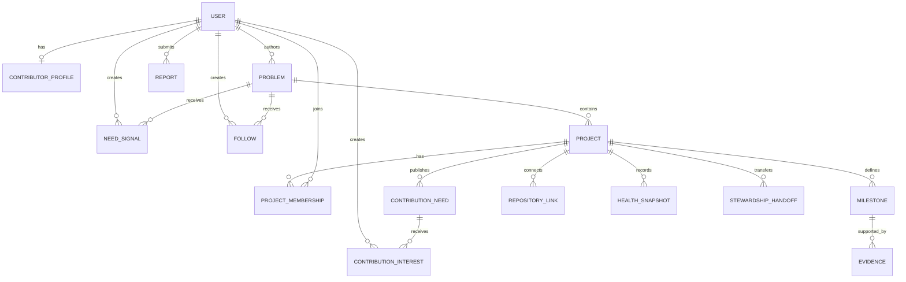

# Domain Model

This document defines product language and invariants before database tables are designed. Storage can change; these meanings should not drift accidentally.

For an everyday-language explanation and a complete worked example, read [`GLOSSARY.md`](GLOSSARY.md). This domain model remains authoritative when wording differs.

## Entity map

## User

Authenticated identity, initially backed by GitHub sign-in.

Key rules:

- Public email is never assumed.
- Account status is separate from project roles.
- Suspension prevents privileged writes without deleting attribution.
- External identity and internal authorization are separate concerns.

## Contributor profile

Optional public contribution context:

- display name and biography;
- skills and non-code roles;
- domains and platforms of interest;
- availability expressed coarsely, not as a binding promise;
- languages, timezone preference, portfolio links;
- onboarding preferences and accessibility needs that the user chooses to share.

## Problem

An unmet need that may support multiple solutions.

Required concepts:

- concise statement;
- affected users or context;
- evidence or examples;
- existing alternatives and why they are insufficient;
- platforms or environments;
- author and moderation status;
- freshness and edit history.

States: `draft`, `open`, `validated`, `closed`, `archived`.

A problem cannot be represented as “build my chosen implementation.” It must leave room to evaluate solutions.

## Need signal

A unique user signal equivalent to **“I need this”**. It may include optional context but is not a vote that grants control.

Invariants:

- one active signal per user per problem;
- reversible by the user;
- protected by rate limits and abuse detection;
- aggregate counts must not expose private identity choices beyond user settings.

## Project

One proposed or active solution under exactly one problem.

Required concepts:

- name and solution statement;
- scope and explicit non-goals;
- steward;
- governance and license;
- health state and last verified update;
- repository links when code exists;
- milestones and current contribution needs.

States: `proposed`, `forming`, `active`, `blocked`, `paused`, `needs_steward`, `completed`, `archived`.

A project may not show `active` indefinitely without fresh evidence.

## Project membership

A user’s relationship to a project. Roles are capability grants plus public labels, not social status.

Initial roles:

- `steward`
- `maintainer`
- `contributor`
- `moderator` (project-scoped when applicable)

Skill labels such as design, documentation, research, translation, testing, and community are profile metadata rather than authorization roles.

## Contribution need

A specific, bounded way to help.

Fields should include:

- title and outcome;
- why it matters now;
- skills and experience level;
- estimated shape of effort, expressed as a range rather than a promise;
- onboarding steps;
- linked GitHub issue or external work item;
- owner or reviewer;
- dependencies and blockers;
- acceptance criteria.

States: `open`, `claimed`, `in_progress`, `blocked`, `done`, `cancelled`.

## Contribution interest

A contributor’s **“I can help”** signal for a contribution need.

It is not automatically a claim. The project can accept, redirect, pair, or decline with a reason. The history remains auditable to protect contributors from silent disappearance.

## Milestone

An outcome-oriented checkpoint, not a bucket of tasks.

Fields:

- outcome and user value;
- target criteria;
- state;
- optional time window, clearly marked as an estimate;
- evidence requirements;
- dependency relationships.

States: `planned`, `active`, `blocked`, `complete`, `cancelled`.

Progress is derived from milestone state and evidence, never from an arbitrary percentage field.

## Evidence

A verifiable artifact supporting progress:

- merged pull request;
- release;
- commit or tag;
- passing test or benchmark;
- demo deployment;
- research result;
- design decision;
- completed external deliverable.

Evidence records source URL, source type, observed timestamp, verification state, and the actor or integration that recorded it.

## Repository link

A project connection to GitHub.

Store repository identity, installation identity, permission scope, default branch, sync status, last successful sync, and revocation state. User OAuth tokens and GitHub App installation tokens are not domain data and must not be exposed to product queries.

## Health snapshot

An explainable, timestamped assessment built from evidence and steward input.

Potential dimensions:

- recent verified activity;
- open contribution needs with responsive owners;
- unresolved blockers;
- release or milestone movement;
- stale project update;
- missing steward;
- repository access failure.

Health is descriptive, not a moral score.

## Stewardship handoff

A recorded transfer of accountability with outgoing steward, incoming steward, reason, current state, unresolved risks, access changes, and acceptance timestamps. Attribution and project history are preserved.

## Follow

A user subscription to public updates for a problem or project. Notification channels are separate preferences.

## Report and moderation action

Reports target content, users, projects, or behavior. Moderation actions record actor, scope, reason code, private notes where necessary, public explanation where safe, timestamps, and appeal state.

## Authorization invariants

- Every protected operation is authorized on the server.
- Project membership never grants global moderation.
- Repository installation access does not automatically grant project stewardship.
- A steward cannot silently erase prior contributors or evidence.
- Moderator actions are auditable and cannot be edited without history.
- Public read models must not leak private reports, tokens, emails, or internal notes.
