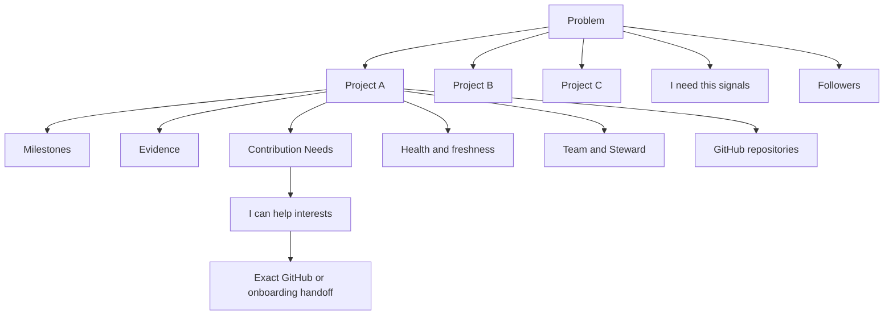
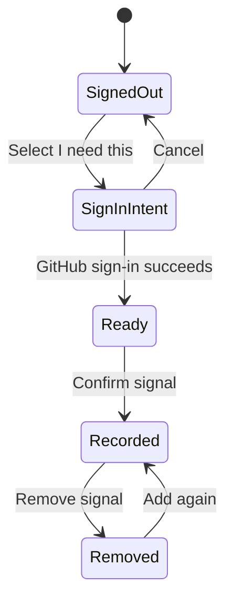
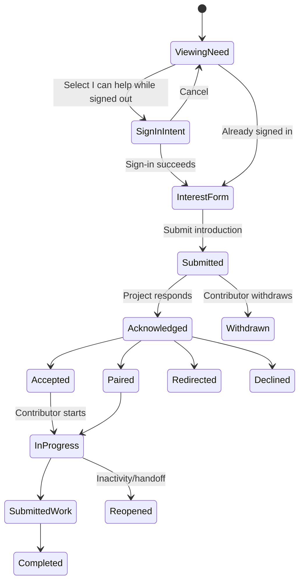

# Product information architecture and core-flow handoff

- **Issue:** #22
- **Status:** implementation direction for review
- **Primary product contract:** [`../PRODUCT.md`](../PRODUCT.md)
- **Domain authority:** [`../DOMAIN_MODEL.md`](../DOMAIN_MODEL.md)
- **Accessibility authority:** issue #14 and the accessibility baseline when merged
- **Research input:** issue #21 and dated briefs under `docs/research/`

## Design thesis

ManyHands should feel less like a social feed and more like a **public field guide to work that matters**.

A visitor should quickly understand:

1. the unmet Problem;
2. who experiences it and what evidence supports it;
3. which Projects are attempting solutions;
4. which Project is healthy, blocked, paused, or seeking stewardship;
5. what each Project needs next;
6. how one person can take a useful next step through GitHub.

The core structural sentence is:

> **A Problem can have several Projects. A Project has people, Contribution Needs, Milestones, Evidence, and Health. GitHub remains authoritative for code.**

The interface must preserve that sentence on mobile, in screen-reader navigation, in search results, and during authenticated actions.

## Design principles

### Problem first, implementation second

A Problem page begins with affected people, context, evidence, and existing alternatives. Repository links and technical approaches belong to Projects below it.

### Multiple solutions without a popularity winner

Projects can be ordered by relevance, verified activity, or a user-selected filter, but the default presentation must not imply that the oldest, largest, or most reacted-to project is “the official answer.”

### Consequences before authentication

A visitor sees what “I need this” or “I can help” will do before being asked to sign in. Authentication preserves intent and returns the person to the same decision.

### Progress must explain itself

A status display names the outcome, current Milestone state, last verified Evidence, blockers, freshness, and source. It does not lead with a percentage.

### Health is descriptive, not moral

“Paused,” “blocked,” “stale sync,” and “needs steward” describe operational state. They are not a score of contributor worth or maintainer effort.

### Every skill gets a doorway

Engineering, design, research, writing, accessibility, testing, translation, moderation, operations, and domain expertise use the same Contribution Need structure.

### Public before personal

People can browse Problems, Projects, progress, and open needs without an account. Identity appears only when an action needs persistence, responsibility, consent, or abuse protection.

## Primary navigation

### Signed out

1. **Problems** — unmet needs and evidence
2. **Projects** — active solution attempts
3. **Needs** — current contribution opportunities
4. **People** — public contributor profiles
5. **How it works** — product model and contribution loop
6. **Sign in** — optional identity entry

### Signed in

1. Problems
2. Projects
3. Needs
4. People
5. **Following** — Problems and Projects the user chose to follow
6. **My work** — contribution interests, active claims, reviews, and stewardship
7. **Profile menu** — profile, settings, sign out

### Moderator additions

Moderators receive a clearly separated **Moderation** destination. Project stewardship never reveals private global reports.

### Navigation rules

- The current destination is represented programmatically and visually.
- Mobile uses one labelled menu control; critical actions are not duplicated in a persistent bottom bar without evidence.
- Search remains contextual within the directory until cross-entity search is implemented.
- “Create” is not a dominant global button. A person chooses **Publish a Problem** or **Propose a Project** in context so the product does not collapse the two concepts.

## Route map

```text
/
/how-it-works
/accessibility
/sign-in
/auth/callback
/auth/error

/problems
/problems/new
/problems/[problemSlug]
/problems/[problemSlug]/edit
/problems/[problemSlug]/history
/problems/[problemSlug]/projects/new

/projects
/projects/[projectSlug]
/projects/[projectSlug]/settings
/projects/[projectSlug]/members
/projects/[projectSlug]/stewardship
/projects/[projectSlug]/milestones
/projects/[projectSlug]/needs/new

/needs
/needs/[needId]
/needs/[needId]/interest

/people
/people/[handle]
/profile/edit
/settings/account

/following
/my-work

/reports/new
/moderation
/moderation/reports/[reportId]
```

Routes are a design contract, not a requirement to implement every page at once. Each vertical slice should add only the routes needed for its complete journey.

## Entity hierarchy



### Information dominance

- On a Problem page, the Problem is dominant and Projects are alternatives.
- On a Project page, the solution scope and Health are dominant; the parent Problem remains visible.
- On a Need page, the bounded outcome and next action are dominant; Project and Problem provide context.
- On a profile page, user-chosen contribution context is dominant; private identity information is absent.

## Page taxonomy

### Directory page

Examples: Problems, Projects, Needs, People.

Required structure:

1. descriptive `h1` and one-sentence purpose;
2. search and filters represented in the URL;
3. active filter summary and clear-all action;
4. result count and sort explanation;
5. results with entity type, relationship, Health/freshness, and next useful fact;
6. empty and degraded states with recovery;
7. pagination or deliberate load-more behavior, not an engagement-oriented infinite feed.

### Entity detail page

Required structure:

1. identity and parent relationship;
2. plain-language summary;
3. status / Health / freshness;
4. primary decision or action;
5. evidence and history;
6. related entities;
7. governance, source, and reporting links.

### Authoring page

Required structure:

1. outcome and explanation before fields;
2. grouped form sections;
3. persistent guidance and examples;
4. validation without data loss;
5. preview where public meaning matters;
6. save draft / publish consequences;
7. recovery after expired session or network failure.

### Operational page

Examples: project settings, membership, moderation, account deletion.

Required structure:

1. scope and authority;
2. current state;
3. explicit consequences;
4. audit/history where privileged;
5. safe confirmation and recovery;
6. no ambiguity between project-scoped and global actions.

## Problem directory

### Result card anatomy

1. **Problem label** — explicit entity type
2. concise unmet-need statement
3. affected context or platform
4. evidence/freshness line
5. number of active/paused solution Projects expressed as context, not popularity
6. open contribution opportunities across Projects, if any
7. demand signal phrased as “people who said they need this,” not votes
8. last meaningful update

### Filters

- platform / environment;
- domain;
- affected audience;
- evidence freshness;
- whether a Project exists;
- whether any Project has open needs;
- whether a Project seeks a Steward;
- language/localization where relevant.

### Sorts

- relevance;
- recently validated;
- recently received verified Project activity;
- currently seeking a solution;
- currently seeking contributors.

Raw “most needed” cannot be the only default because it invites manipulation and entrenches early visibility.

## Problem detail

### Above the fold

- `Problem` entity label;
- concise statement;
- affected people/context;
- evidence freshness;
- **I need this** action with consequence explanation;
- follow action;
- existing-solutions summary;
- publish/propose action only when signed-in authority is relevant.

### Main sections

1. **The unmet need**
2. **Who experiences it**
3. **Evidence and examples**
4. **Existing alternatives and gaps**
5. **Projects attempting solutions**
6. **What help is needed across projects**
7. **Revision and moderation history**

### Multiple-project comparison

Projects appear as peer cards or rows with the same information density:

- solution statement;
- scope/non-goal summary;
- Health text;
- last verified update;
- current Milestone;
- open Needs by skill;
- Steward;
- license;
- GitHub/source links.

The comparison does not show stars, follower counts, or a default winner badge.

## “I need this” flow

### Before authentication

A disclosure appears near the action:

> “This records that the Problem affects or matters to you. It does not vote for a particular Project, grant governance authority, or subscribe you to marketing.”

Optional context can explain environment or impact. Public identity visibility is a separate choice.

### State flow



### Completion feedback

- confirms the signal;
- shows whether follow is also enabled;
- offers Projects and open Needs as optional next steps;
- never implies that a Project will be built because a count increased.

## Project directory

### Result card anatomy

- `Project` entity label;
- parent Problem link;
- solution statement;
- Health state in text;
- current Milestone and blocker summary;
- last verified Evidence and sync time;
- Steward;
- current open Needs;
- license and source-host indicator.

### Filters

- Health;
- platform/domain;
- license;
- open Needs and skill;
- forming / active / paused / needs steward;
- verified activity freshness;
- code host when additional forges exist later.

## Project detail

### Header

- parent Problem breadcrumb;
- Project name and solution statement;
- Health with explanation and freshness;
- Steward/team;
- source and license;
- follow action;
- project-scoped manage action only for authorized users.

### Main page order

1. **What this Project is trying**
2. **Scope and explicit non-goals**
3. **Current Health and blockers**
4. **Open Contribution Needs**
5. **Milestones and Evidence**
6. **Recent verified activity**
7. **Team and governance**
8. **Repositories and external community links**
9. **History, pause/archive, and stewardship**

Open Needs appear before a dense activity feed because the product goal is useful participation, not watching events.

## Contribution Need directory and detail

### Need card

- outcome, not task jargon;
- Project and parent Problem;
- contribution kind and skills;
- experience/context level;
- effort shape expressed as a range;
- owner/reviewer;
- handoff readiness;
- response freshness;
- state: open, claimed, in progress, blocked, done, or cancelled.

### Need detail order

1. outcome and why it matters now;
2. what success looks like;
3. context and prerequisites;
4. skills, including non-code roles;
5. dependencies and blockers;
6. owner/reviewer and response expectation;
7. exact GitHub issue or onboarding path;
8. public history and completed Evidence where relevant.

## “I can help” flow

### Consequence disclosure

Before authentication or submission:

> “This introduces your interest to the Project. It does not reserve the work or promise acceptance. A Steward can accept, pair, redirect, or decline with a reason.”

### Flow



### Required messages

- submitted: what happens next and expected response window;
- accepted: exact GitHub/onboarding action;
- paired: collaborators and coordination channel;
- redirected: why another Need is a better fit;
- declined: respectful reason and optional alternatives;
- inactive: work can be reopened without erasing contribution;
- completed: linked Evidence and credit choice.

## Milestones and Evidence

### Milestone presentation

Each item shows:

- outcome;
- state in text;
- completion criteria;
- blocker and next action when blocked;
- Evidence count and most recent verified artifact;
- optional estimate explicitly labelled as an estimate;
- dependencies.

### Progress summary

Use plain text first:

> “2 of 4 outcomes complete. The active milestone is blocked by GitHub App approval. Last verified evidence: merged PR #123, 2 days ago.”

A visual bar may supplement this only when the derivation is available in adjacent text.

### Evidence presentation

- type;
- title;
- source;
- observed/verified time;
- verification state;
- contributor attribution;
- direct authoritative link;
- correction/revocation history.

## Health system presentation

### Health states

| State | Meaning | Primary UI behavior |
|---|---|---|
| Forming | Scope/team/repository is still being established | Invite specific formation help |
| Active | Fresh verified progress and responsive stewardship | Show open Needs and current Milestone |
| Blocked | A named dependency prevents progress | Show blocker, owner, and next action |
| Paused | Steward deliberately stopped work temporarily | Preserve context; do not imply active contribution review |
| Needs steward | Work can continue but accountable stewardship is missing | Elevate handoff information and risks |
| Completed | Defined outcome reached | Show Evidence, release/use path, and maintenance state |
| Archived | No active work is expected | Preserve history; remove from default active discovery |
| Sync degraded | GitHub evidence cannot currently be refreshed | Separate integration failure from project inactivity |

### Health card anatomy

- text state;
- one-sentence explanation;
- source and observation time;
- relevant signals;
- steward update time;
- next action;
- “How this was determined” disclosure.

No red/green-only dot and no universal numeric score.

## Contributor profiles

### Public profile

Only user-chosen public information:

- display name and handle;
- biography;
- skills and non-code roles;
- interests/domains;
- languages;
- coarse availability;
- timezone preference;
- public links;
- verified public contributions and opt-in recognition later.

Never display private GitHub email, OAuth identity payload, token, report history, security telemetry, or internal moderation notes.

### Profile editing

- sections: identity presentation, skills/roles, interests, availability, links, visibility;
- live character/count guidance;
- field errors preserved on submit;
- visibility consequence explained before save;
- handle conflict offers alternatives without revealing another user’s private state;
- public preview before changing from private/members to public.

## Account states

### Suspended

- public attribution remains according to profile/history rules;
- protected actions are unavailable;
- the user receives a safe state notice and appeal route where applicable;
- no private moderation reason is exposed publicly.

### Deletion requested

- protected writes are locked;
- the user sees that deletion is processing;
- failure compensation restores safe account access;
- completed deletion anonymizes optional profile information while preserving neutral historical attribution.

### Signed out / expired / revoked

- public content remains;
- protected actions explain that identity is required;
- intended safe return path is preserved;
- invalid or revoked session clears unsafe assumptions and provides sign-in/retry;
- no redirect loop.

## Low-fidelity wireframes

### Desktop Problem detail

```text
┌────────────────────────────────────────────────────────────────────────────┐
│ ManyHands   Problems  Projects  Needs  People            Search   Sign in │
├────────────────────────────────────────────────────────────────────────────┤
│ PROBLEM                                                                    │
│ A capable image editor is missing for a class of Linux workflows           │
│ Affects: creators / Linux · Evidence updated 4 days ago                    │
│ [ I need this ] [ Follow ]                              [ Propose project ] │
├─────────────────────────────────┬──────────────────────────────────────────┤
│ The unmet need                  │ At a glance                              │
│ Who experiences it              │ 3 projects · 2 active · 1 forming        │
│ Evidence and alternatives       │ 7 open needs · last verified today       │
├─────────────────────────────────┴──────────────────────────────────────────┤
│ Projects attempting solutions                                              │
│ ┌ Project A ─ Active ─────────┐ ┌ Project B ─ Blocked ──────────────────┐ │
│ │ Scope / current milestone    │ │ Scope / blocker / next action          │ │
│ │ 3 open needs                 │ │ 1 research need                        │ │
│ │ Steward · Evidence · Source  │ │ Steward · Evidence · Source            │ │
│ └──────────────────────────────┘ └────────────────────────────────────────┘ │
├────────────────────────────────────────────────────────────────────────────┤
│ Open contribution needs across projects                                   │
├────────────────────────────────────────────────────────────────────────────┤
│ Revision history · report · source/model explanation                       │
└────────────────────────────────────────────────────────────────────────────┘
```

### Mobile Problem detail

```text
┌──────────────────────┐
│ ManyHands       Menu │
├──────────────────────┤
│ PROBLEM              │
│ A capable image...   │
│ Linux · 4 days ago   │
│ [ I need this ]      │
│ [ Follow ]           │
├──────────────────────┤
│ The unmet need       │
│ affected people...   │
├──────────────────────┤
│ Evidence             │
├──────────────────────┤
│ 3 solution projects  │
│ ┌ Project A        ┐ │
│ │ Active           │ │
│ │ milestone...     │ │
│ │ 3 open needs     │ │
│ └──────────────────┘ │
│ ┌ Project B        ┐ │
│ │ Blocked          │ │
│ │ next action...   │ │
│ └──────────────────┘ │
├──────────────────────┤
│ Contribution needs   │
├──────────────────────┤
│ History / report     │
└──────────────────────┘
```

### Project detail

```text
PROBLEM: linked parent
PROJECT: name
Solution statement
Health: Active — evidence verified 2 days ago
Steward / license / source
[ Follow project ] [ Manage project — authorized only ]

What this project is trying
Scope / non-goals

OPEN CONTRIBUTION NEEDS
[Design outcome] [Research outcome] [Engineering outcome]

MILESTONES AND EVIDENCE
Planned → Active → Complete
Blockers and next action

TEAM / GOVERNANCE / REPOSITORIES / HISTORY
```

### Need detail

```text
CONTRIBUTION NEED · Design
Create the mobile comparison pattern for multiple projects
Project → Parent Problem
Open · Reviewer responds within a stated window

Outcome / why now
Acceptance criteria
Context and prerequisites
Dependencies
Owner/reviewer
Exact handoff

[ I can help ]
This introduces interest; it does not reserve the work.
```

## Responsive behavior

### Breakpoints are content-driven

Do not treat device names as product requirements. Use layout transitions when content no longer reads comfortably.

### Wide

- directory filter panel may remain alongside results;
- Problem/Project summary may use a secondary facts column;
- comparison cards can use two columns when information remains equivalent;
- dense evidence/history can use responsive tables with labelled overflow.

### Medium

- filters collapse into a clearly labelled disclosure while active filters remain visible;
- secondary facts move below the summary;
- cards use one or two columns based on content length, not uniform height.

### Narrow / zoomed

- one reading column;
- entity label, title, Health, and primary action remain early;
- action labels remain text, not icon-only;
- tables become structured cards or one labelled horizontal region;
- breadcrumbs wrap or reduce to one parent link;
- no fixed panel consumes the viewport;
- long handles, repository names, URLs, tags, and translated text wrap safely.

## Accessible interaction specification

### Focus

- skip link targets a focusable `main`;
- route changes place focus on the page heading or maintain expected browser behavior with a clear announcement;
- dialogs return focus;
- filter application does not unexpectedly move focus;
- validation focuses a summary and links errors to fields.

### Names and relationships

Cards include the entity type in accessible context. A screen-reader user should not encounter five identical “View details” links. Prefer:

- “View Problem: Offline-first collaborative image editing”
- “View Project: Cedar Editor”
- “I can help with: Mobile comparison design”

### Motion

- no parallax or looping decorative motion in core directory/detail flows;
- route/accordion/card transitions are optional and removed under reduced motion;
- status changes use text and announcement, not animation.

### Contrast and forced colors

- entity type, state, and action remain visible in forced colors;
- outlines/borders use system colors where custom color disappears;
- status chips include text and do not rely on filled color.

### Dynamic status

Announce only task-relevant outcomes:

- “Need signal recorded.”
- “3 results. Filter: projects seeking a steward.”
- “Interest sent. The reviewer’s expected response window is 5 days.”
- “GitHub evidence is temporarily stale; last successful sync was 2 hours ago.”

## Content rules

### Problem statements

Use:

> “[Affected people] cannot [outcome] in [context] because [gap/evidence].”

Avoid:

> “Someone should build clone X.”

### Project solution statements

Use:

> “This Project is testing [approach] for [audience/context], beginning with [scope].”

Avoid superiority claims without Evidence.

### Contribution Needs

Lead with the outcome:

> “Document how a self-hoster restores a backup.”

Not an internal imperative:

> “Write docs.”

### Status language

- “Active — milestone evidence verified 2 days ago”
- “Blocked — waiting for upstream API approval; Steward will recheck Friday”
- “Needs steward — handoff notes and access checklist available”

Avoid “dead,” “abandoned by owner,” or red/green judgment language.

### Authentication

Explain why before redirect:

> “Sign in with GitHub to keep this signal attached to you and prevent duplicate abuse. This does not install a GitHub App or grant repository access.”

## Small design-token direction

Tokens should express semantics and remain replaceable.

```text
color.page
color.surface
color.surface.subtle
color.text
color.text.muted
color.border
color.action
color.action.hover
color.focus
color.status.informative
color.status.warning
color.status.critical

space.1 ... space.8
radius.control
radius.card
radius.panel
shadow.raised
measure.reading
measure.shell
motion.fast
motion.standard
```

Rules:

- one primary action color, not one color per feature;
- status semantics pair color with text/icon/pattern;
- focus has its own token and is never removed;
- dark mode uses semantic equivalence, not inverted hex values;
- spacing supports reflow and touch, not rigid screenshot matching;
- motion tokens resolve to zero/near-zero under reduced motion.

## Initial component inventory

Create a component only after at least one real flow needs it.

### Foundations

- `PageShell`
- `SkipLink`
- `SiteHeader`
- `SiteFooter`
- `Button` / `LinkButton`
- `TextField`, `TextArea`, `Select`, `Checkbox`
- `FieldError`, `FormErrorSummary`, `StatusMessage`
- `Disclosure`
- `Dialog` when a true modal is required

### Domain presentation

- `EntityLabel`
- `ProblemSummary`
- `ProjectSummary`
- `ContributionNeedSummary`
- `HealthSummary`
- `FreshnessStamp`
- `MilestoneList`
- `EvidenceList`
- `StewardSummary`
- `SourceLink`

### Directory behavior

- `SearchField`
- `FilterGroup`
- `ActiveFilters`
- `SortControl`
- `ResultCount`
- `Pagination`
- `EmptyState`
- `DegradedState`

Do not build a generic dashboard-card framework before domain summaries expose their actual information needs.

## State tables for engineering

### Protected action entry

| Condition | Result |
|---|---|
| Signed out, safe return path | Explain identity → GitHub sign-in → return to action |
| Signed out, unsafe return path | Ignore unsafe value → use known safe fallback |
| Signed in, active | Continue action |
| Signed in, suspended | Preserve public read; show restricted-action state and appeal path |
| Signed in, deletion requested | Show processing/write-locked state |
| Session expired/revoked | Clear trusted identity assumption; explain and offer sign-in |
| Provider denied | Return to explanation with non-sensitive message |
| Callback invalid/reused | Safe error; no redirect loop or token detail |

### Contribution interest

| State | Contributor sees | Steward sees |
|---|---|---|
| Open | Outcome and “I can help” consequence | Need state and response expectation |
| Submitted | Confirmation and expected response | New interest with private onboarding answers |
| Accepted | Exact next action | Acknowledgement and owner |
| Paired | Collaborator/context | Pairing participants |
| Redirected | Reason and alternative Need | Audit history |
| Declined | Respectful reason | Audit history |
| Withdrawn | Closed personal state | History, no active claim |
| Inactive | Handoff/reopen explanation | Reopen/extend decision |
| Completed | Evidence and credit choice | Completion Evidence |

## Loading, empty, error, and degraded states

Every route must define:

- initial loading that preserves page structure;
- no results with filter recovery;
- no Project yet, with formation explanation;
- no open Needs, without implying project completion;
- stale GitHub sync with last successful time;
- permission denied with safe alternative;
- removed/moderated content without private details;
- network/server retry while preserving entered form data;
- unknown error with correlation identifier but no stack trace.

## Comprehension review script

Ask a participant unfamiliar with ManyHands to use the low-fidelity flow and answer:

1. What is the Problem?
2. How is a Project different?
3. Can several Projects address the same Problem?
4. Which Project is active, blocked, or seeking a Steward, and why?
5. What would happen if you selected “I need this”?
6. What would happen if you selected “I can help”?
7. Where would code review happen?
8. Which non-code contribution could you make?
9. How do you know progress is real?
10. What would you do if the Project stopped responding?

Record misunderstanding before asking whether the design “looks good.”

## Engineering delivery sequence

1. Identity/profile vertical slice (#5)
2. Problem directory/detail/create and need-signal slice (#6)
3. Project formation/detail/team slice (#7)
4. Contribution Need and interest slice (#8)
5. Milestone/Evidence slice (#9)
6. GitHub bridge (#10)
7. Discovery/search (#11)
8. Trust and safety (#12)
9. Health/stewardship handoff (#13)
10. Founding recognition and dogfooding (#15/#17)

Each slice should implement one complete journey with public read, authenticated write, denial, error, accessibility, and evidence—not a collection of disconnected screens.

## Acceptance notes for future UI pull requests

A pull request implementing this architecture should show:

- route and user outcome;
- Problem/Project/Need relationship in visible and accessible context;
- signed-out behavior;
- authorized and unauthorized states;
- loading, empty, error, and degraded states;
- narrow and wide screenshots;
- keyboard and focus evidence;
- screen-reader semantics;
- reduced-motion and forced-colors considerations;
- source/freshness behavior;
- tests on the exact head;
- explicit deviations from this handoff and the issue/ADR approving them.

## Open questions requiring validation

- Does “Problems” read clearly enough, or does the public need a more human label such as “Needs” while retaining `Problem` internally?
- How much evidence is necessary before a Problem can be published versus marked validated?
- Which project-comparison facts matter without creating ranking pressure?
- What response expectation can projects honestly publish for Contribution Interests?
- Should member-only profiles exist in v0 or should visibility be private/public initially?
- How is demand context shown without making raw count the dominant discovery signal?
- How much Health can be derived before steward confirmation becomes necessary?
- Which actions require notifications in the first stable loop?

These questions should be tested through issue #21 interviews and prototypes rather than answered by visual preference alone.
